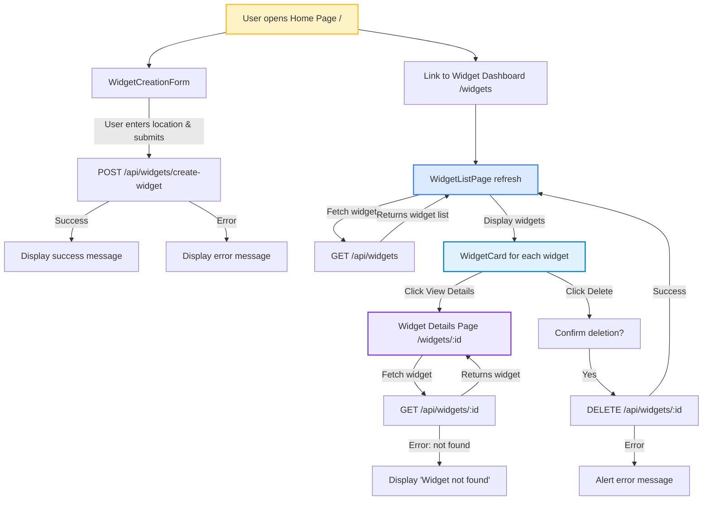

# Weather Widget Dashboard

## Overview
This project is a **Weather Widget Dashboard** built with **Next.js 15** (frontend) and a **Node.js/Express backend**.  
Users can create widgets for locations to display weather data, view them in a dashboard, and manage them (delete).  

The **weather data** is fetched from a public API ([OpenWeatherMap](https://open-meteo.com/)) and cached in the backend to reduce redundant API calls.

---

## Project Structure

/backend # Node.js/Express backend

/frontend # Next.js 15 frontend with Tailwind CSS

- Backend folder contains the API, database models, caching logic, and integration with the weather API.  
- Frontend folder contains the Next.js app, pages, components, and client-side logic.

---

## Goals
- Provide a **simple dashboard** for managing weather widgets.  
- Demonstrate **full-stack integration** with caching and API usage.  
- Practice **React/Next.js 15 features** like client components, routing, and server-side interactions.  

---

## Functional Requirements
1. Users can **create a weather widget** by providing a location.  
2. Users can **view all widgets** in a dashboard with basic weather information.  
3. Users can **view details** of each widget, including coordinates and more weather data.  
4. Users can **delete widgets**, which updates the dashboard immediately.  
5. **Caching** is implemented in the backend for weather data to reduce API calls.  

---

## Installation
- **Backend:** See the `backend/README.md` for installation and running instructions.  
- **Frontend:** See the `frontend/README.md` for installation and running instructions.

---

## Documentation

- **Backend API documentation:** See `backend/README.md`.
- **Frontend API documentation:** See `frontend/README.md`.

- **Frontend Interaction Diagram:**  

---
